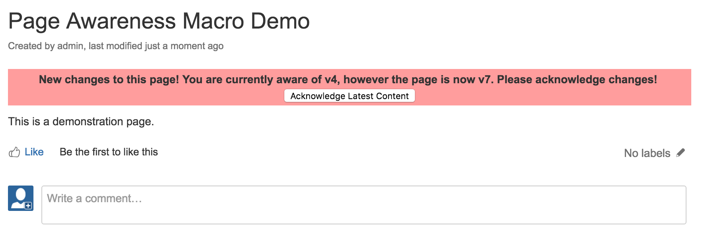
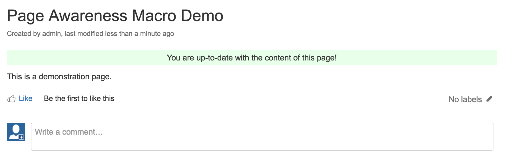

A user macro for Confluence that provides a simple way for user to easily know if the page they
are viewing has been changed since the last time they acknowledged the content of the page.

## Adding to Confluence

- Go to the Confluence Administration Console.
- Select 'User Macros'
- Select 'Create a User Macro'
- Enter 'pageawareness' for the macro name
- Enter 'Page Awareness' for the macro title
- Paste the contents of pageawareness.vm into the template field.
- Select 'Save'

## Add to a Page

- When editing a page select 'Insert > Other Macros'
- Search for 'Page Awareness'
- Insert the macro

## Screenshots

# 

# 
